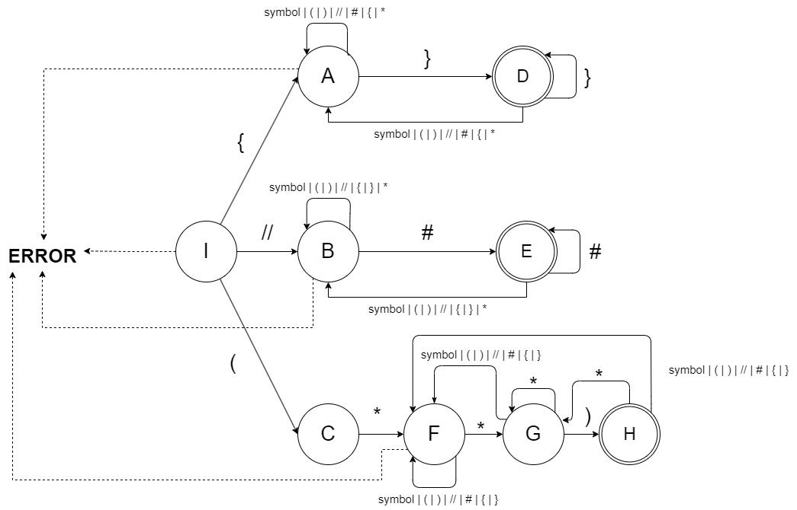
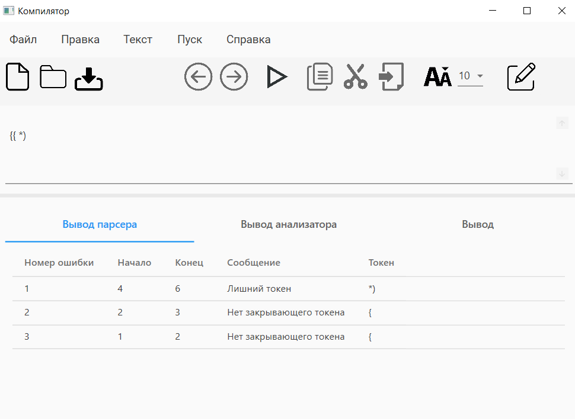
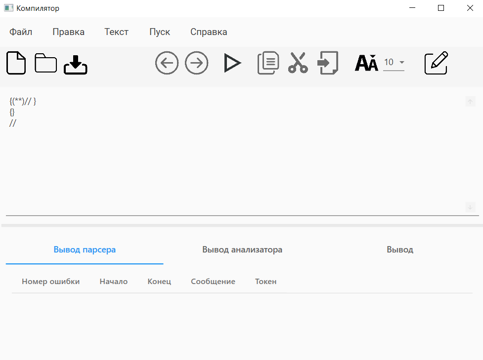
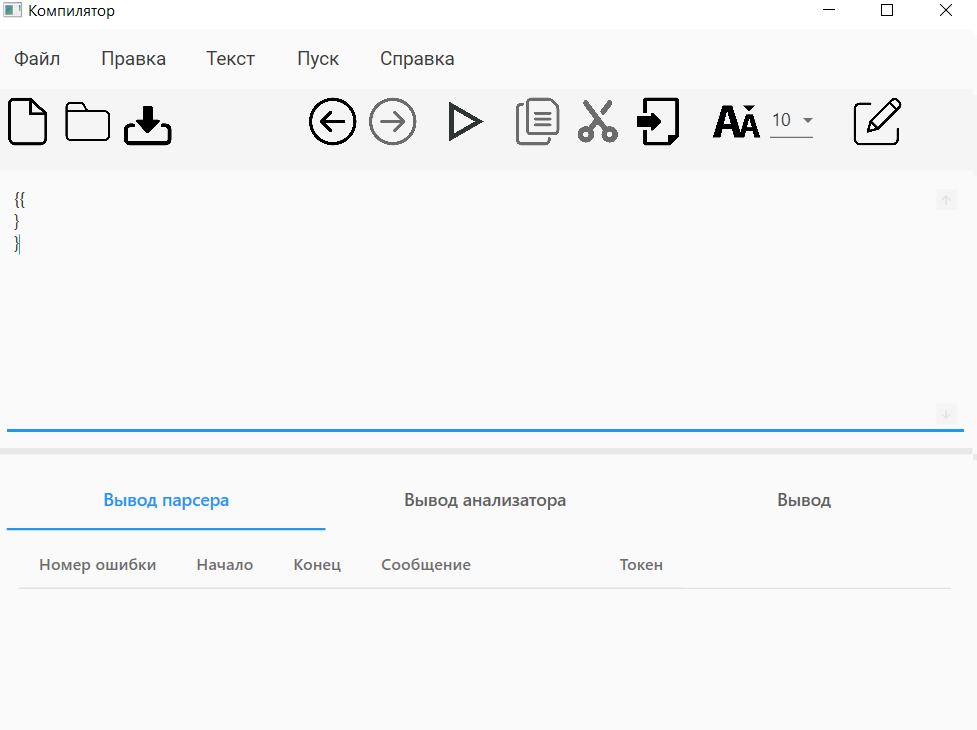
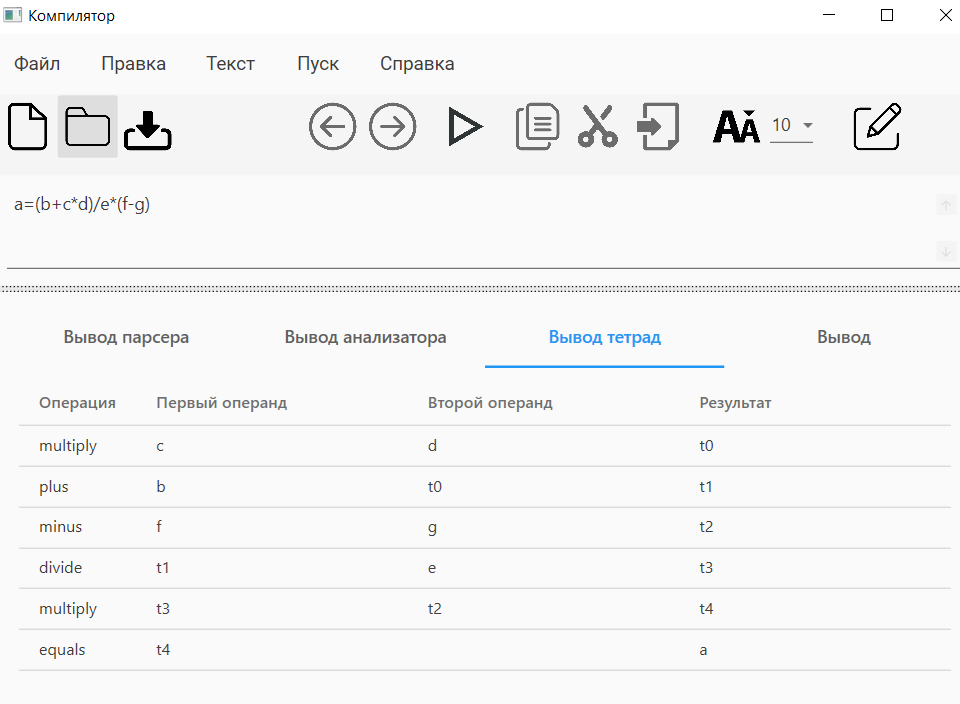
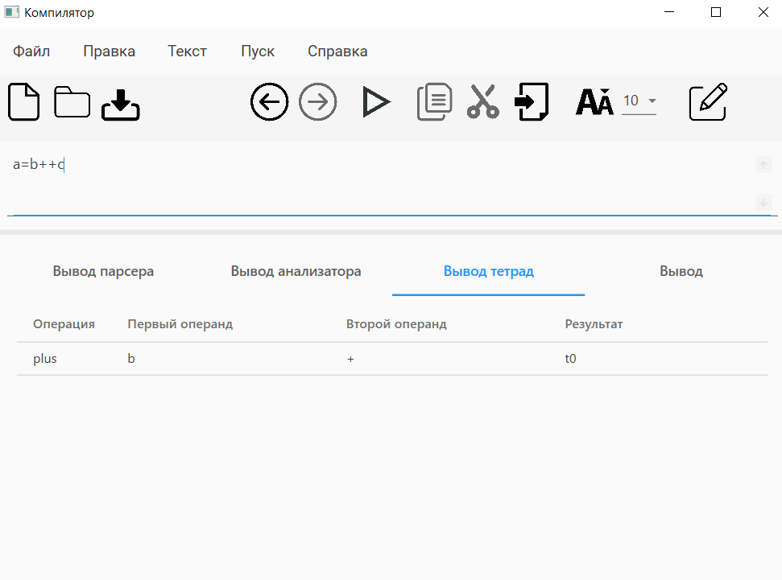
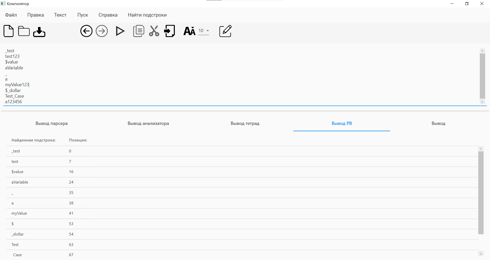
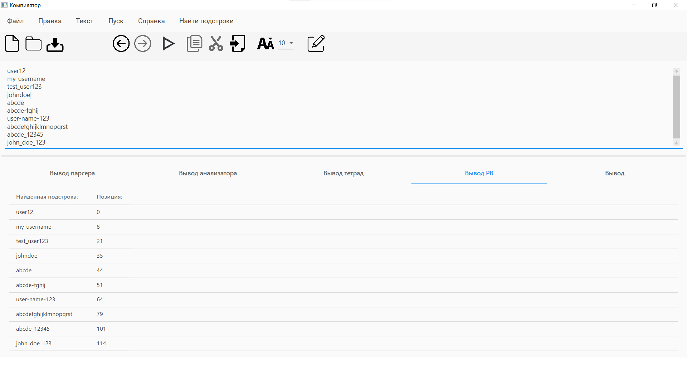
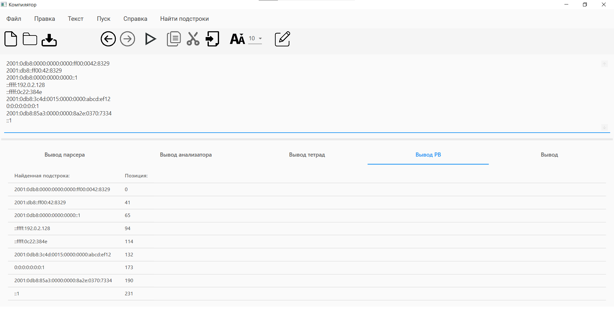

<!DOCTYPE html>
<html>
<body>
  <h1>Компилятор</h1>
  
Разработка текстового редактора с функциями языкового процессора.

  <h2>Оглавление</h2>
  <ul>
    <li><a href="#lab1">Лабораторная работа №1: Разработка пользовательского интерфейса (GUI) для языкового процессора</a></li>
    <li><a href="#lab2">Лабораторная работа №2: Разработка лексического анализатора (сканера)</a></li>
    <li><a href="#lab3">Лабораторная работа №3: Разработка синтаксического анализатора (парсера)</a></li>
    <li><a href="#lab4">Лабораторная работа №4: Нейтрализация ошибок (метод Айронса)</a></li>
    <li><a href="#lab5">Лабораторная работа №5: Включение семантики в анализатор. Создание внутренней формы представления программы</a></li>
    <li><a href="#lab6">Лабораторная работа №6: Реализация алгоритма поиска подстрок с помощью регулярных выражений</a></li>
    <li><a href="#lab7">Лабораторная работа №7: Реализация метода рекурсивного спуска для синтаксического анализа</a></li>
  </ul>

  <h2 id="lab1">Лабораторная работа №1: Разработка пользовательского интерфейса (GUI) для языкового процессора</h2>
  
Тема: разработка текстового редактора с возможностью дальнейшего расширения функционала до языкового процессора.

  
Цель работы: разработать приложение с графическим интерфейсом пользователя, способное редактировать текстовые данные. Это приложение будет базой для будущего расширения функционала в виде языкового процессора.

  
Язык реализации: C#, WPF.

  <h3>Интерфейс текстового редактора</h3>
  
Главное окно программы

  
  
  <h3>Получившийся текстовый редактор имеет следующие элементы:</h3>
  <ol>
    <li value="1">Заголовок окна.</li>  
    
Содержит информацию о названии открытого файла, полного пути к нему, а также о том, сохранен ли он на текущий момент (наличие символа звездочки справа от названия означает наличие несохраненных изменений).

    <li value="2">Меню.</li>  
    <table>
      <tr>
        <th>Пункт меню</th>
        <th>Подпункты</th>
      </tr>
      <tr>
        <td>Файл</td>
        <td></td>
      </tr>
      <tr>
        <td>Правка</td>
        <td></td>
      </tr>
      <tr>
        <td>Текст</td>
        <td></td>
      </tr>
      <tr>
        <td>Пуск</td>
        <td>Отсутствует</td>
      </tr>
      <tr>
        <td>Справка</td>
        <td></td>
      </tr>
    </table>
    <li value="3">Панель инструментов</li>
	
      <ul>
        <li>Создать</li>
        <li>Открыть</li>
        <li>Сохранить</li>
        <li>Отменить</li>
        <li>Повторить</li>
        <li>Копировать</li>
        <li>Вырезать</li>
        <li>Вставить</li>
        <li>Изменить размер текста</li>
      </ul>
    <li value="4">Область редактирования</li>
    
Поддерживаются следующие функции:

      <ul>
        <li>Изменение размера текста</li>
        <li>Открытие файла при перетаскивании его в окно программы</li>
      </ul>
    <li value="5">Область отображения результатов</li>
    
В область отображения результатов выводятся сообщения и результаты работы языкового процессора.

    
Поддерживаются следующие функции:

      <ul>
        <li>Изменение размера текста</li>
        <li>Отображение ошибок в виде таблицы</li>
      </ul>
  </ol>
    <h3>Справочная система</h3>
    
Разделы справочной системы открываются как HTML-документы в браузере.

    <table>
      <tr>
        <th>Раздел</th>
        <th>Изображение</th>
      </tr>
      <tr>
        <td>Вызов справки</td>
        <td></td>
      </tr>
      <tr>
        <td>О программе</td>
        <td></td>
      </tr>
    </table>
    <h3>Вывод сообщений</h3>
    <table>
      <tr>
        <th>Сообщение</th>
        <th>Описание</th>
      </tr>
      <tr>
        <td>Закрытие окна программы</td>
        <td>Появляется при закрытии программы нажатием крестика или комбинацией клавиш при наличии несохраненных изменений</td>
      </tr>
      <tr>
        <td>Сохранение изменений</td>
        <td>Появляется при попытке открыть существующий файл или создать новый при наличии несохраненных изменений	Сохранение изменений</td>
      </tr>
    </table>
   
  <h2 id="lab2">Лабораторная работа №2: Разработка лексического анализатора (сканера)</h2>
  
Тема: разработка лексического анализатора (сканера).

  
Цель работы: изучить назначение лексического анализатора. Спроектировать алгоритм и выполнить программную реализацию сканера.

  
  <table>
    <tr>
      <th>№</th>
      <th>Тема</th>
      <th>Пример верной строки</th>
      <th>Справка</th>
    </tr>
    <tr>
      <td>50</td>
      <td>Комментарии языка Pascal</td>
      <td>{ Это комментарий } (* Это тоже комментарий *) </td>
      <td><a href="https://pascalabc.net/downloads/pabcnethelp/index.htm?page=LangGuide/_ProgrStruct_Defs/comments.html		">Справка</a></td>
    </tr>
  </table>

  <h3>В соответствии с вариантом задания необходимо:</h3>
  <ol>
    <li>Спроектировать диаграмму состояний сканера.</li>
    <li>Разработать лексический анализатор, позволяющий выделить в тексте лексемы, иные символы считать недопустимыми (выводить ошибку).</li>
    <li>Встроить сканер в ранее разработанный интерфейс текстового редактора. Учесть, что текст для разбора может состоять из множества строк.</li>
  </ol>

  
Входные данные: строка (текст программного кода).

  
Выходные данные: последовательность условных кодов, описывающих структуру разбираемого текста с указанием места положения и типа.

  <h3>Примеры допустимых строк</h3>
  <pre>
	{ Это комментарий } (* Это тоже комментарий *)

	var Version: integer; // Версия продукта
	
	{ Это еще один (* комментарий *)}
  </pre>

  <h3>Диаграмма состояний сканера</h3>
  

  <h3>Тестовый пример</h3>
  <h4>Тест. Пример, показывающий все возможные лексемы, которые могут быть найдены лексическим анализатором.</h4>
  
  
  <h2 id="lab3">Лабораторная работа №3: Разработка синтаксического анализатора (парсера).</h2>
  
Тема: разработка лексического анализатора (сканера).

  
Цель работы: Изучить назначение синтаксического анализатора. Спроектировать алгоритм и выполнить программную реализацию парсера.

  <table>
    <tr>
      <th>№</th>
      <th>Тема</th>
      <th>Пример верной строки</th>
      <th>Справка</th>
    </tr>
    <tr>
      <td>50</td>
      <td>Комментарии языка Pascal</td>
      <td>{ Это комментарий } (* Это тоже комментарий *) </td>
      <td><a href="https://pascalabc.net/downloads/pabcnethelp/index.htm?page=LangGuide/_ProgrStruct_Defs/comments.html		">Справка</a></td>
    </tr>
  </table>

  <h3>В соответствии с вариантом задания на курсовую работу необходимо:</h3>
  <ol>
    <li>Разработать автоматную грамматику.</li>
    <li>Спроектировать граф конечного автомата (перейти от автоматной грамматики к конечному автомату).</li>
    <li>Выполнить программную реализацию алгоритма работы конечного автомата.</li>   
    <li>Встроить разработанную программу в интерфейс текстового редактора, созданного на первой лабораторной работе.</li>
  </ol>
  <h3>Грамматика:</h3>
  
G[I]; 

  
Vt = { 'a'...'z', 'A'...'Z', '0'...'9', '(*', '*)', '{', '}', '//' }

  
Vn = { A, B, C, D, E, F, G, H, I }

  
P = {

  
	I -> { A | // B | ( C

  
	A -> ( symbol | ( | ) | // | # | { | * ) A | } D

  
	D -> ( symbol | ( | ) | // | # | { | * ) A | } D | epsilon

  
	B -> ( symbol | ( | ) | // | { | } | * ) B | # E

  
	E -> ( symbol | ( | ) | // | { | } | * ) B | # E | epsilon

  
	C -> * F

  
	F -> ( symbol | ( | ) | // | # | { | } ) F | * G 

  
	G -> ( symbol | ( | ) | // | # | { | } ) F | * G | ) H

  
	H -> ( symbol | ( | ) | // | # | { | } ) F | * G | epsilon

  
	symbol -> ‘a’ | ‘b’ | … | ‘z’ | ‘A’ | ‘B’ | … | ‘Z’ | ‘0’ | ‘1’ | … | ‘9’

  
}

  <h3>Классификация грамматики:</h3>
  Согласно классификации Хомского, грамматика G[Z] является полностью автоматной.
  
  <h3>Граф конечного автомата</h3>
  
  <h3>Тестовые примеры:</h3>
  <ol>
    <li><h4>Тест 1: Пример ошибок</h4></li>
	  
    <li><h4>Тест 2: Все комментарии написаны правильно </h4></li>
	  
  </ol>

  <h2 id="lab4">Лабораторная работа №4: Нейтрализация ошибок (метод Айронса).</h2>
  
Тема: Нейтрализация ошибок (метод Айронса).

  
Цель работы: Реализовать алгоритм нейтрализации синтаксических ошибок и дополнить им программную реализацию парсера.

  <h3>метод Айронса:</h3>
  
Разрабатываемый синтаксический анализатор построен на базе автоматной грамматики. При нахождении лексемы,
  которая не соответствует грамматике предлагается свести алгоритм нейтрализации к последовательному удалению 
  следующего символа во входной цепочке до тех пор, пока следующий символ не окажется одним из допустимых в данный момент разбора. 

  
  
Этот алгоритм был мной уже реализован в Лабораторной работе №3. В таблице ошибок выводятся их местоположение и 
  текст ошибки, содержащий информацию об отброшенном фрагменте.

  <h3>Тестовые примеры:</h3>
  
Нажатие кнопки справа от изменения размера текста позволяет автоматически исправить ошибки.

  <ol>
    <li><h4>Тест 1: Пример ошибок</h4></li>
	  
    <li><h4>Тест 2: Исправленный код </h4></li>
	  
  </ol>

  <h2 id="lab5">Лабораторная работа №5: Включение семантики в анализатор. Создание внутренней формы представления программы.</h2>
  
Тема: включение семантики в анализатор. Создание внутренней формы представления программы. В качестве внутренней формы представления программы выберем тетрады. Тетрада имеет четыре поля: op, arg1, arg2 и result.

  
Цель работы: дополнить анализатор, разработанный в рамках лабораторных работ, этапом формирования внутренней формы представления программы.

  
  <h3>Задание:</h3>
  
  

    
1. Дополнить парсер грамматикой G[<АВ>]. Реализовать данную КС-граммматику методом рекурсивного спуска:
     
 1. АВ -> id = T
     
 2. E → TA 
     
 3. A → ε | + TA | - TA 
      
4. T → ОВ 
     
 5. В → ε | *ОВ | /ОВ 
     
 6. О → id | (E) 
    
 2. Реализовать алгоритм записи выражений в форме тетрад.
  

  
  <h3>Тестовые примеры</h3>
  <h4>Тест №1 Пример без ошибок.</h4>
  
  <h4>Тест №2 Пример с ошибокой.</h4>
  

<h2 id="lab6">Лабораторная работа №6: Реализация алгоритма поиска подстрок с помощью регулярных выражений.</h2>
  
Тема: реализация алгоритма поиска подстрок с помощью регулярных выражений.

  
Цель работы: реализовать алгоритм поиска в тексте подстрок, соответствующих заданным регулярным выражениям.

  <h3>Задание:</h3>

  

    1. Построить РВ для поиска идентификатора, который может
начинаться только с буквы a-zA-Z, знака доллара $ или подчеркивания _,
оставшаяся часть символов идентификатора представляют собой только
буквы a-zA-Z.
<pre>
      string pattern = @"[$a-zA-Z_][a-zA-Z]*";
</pre>
    Это регулярное выражение означает следующее:  
    [$a-zA-Z_] - первый символ должен быть буквой (a-zA-Z), подчеркиванием (_) или знаком доллара ($) 
    [a-zA-Z]* - остальные символы должны быть буквами (a-zA-Z) 
    Тест:  
    _test 
    test123 
    $value 
    aVariable 
    _ 
    a 
    myValue123 
    $_dollar 
    Test_Case 
    a123456 
    
  

  

    2. Построить РВ, описывающее стандартный формат юзернейма
(содержит цифры, строчные буквы, символы - и _, имеет длину от 5 до 20
знаков)
<pre>
         string pattern = @"\b[a-z0-9_-]{5,20}\b";
</pre>
    Это регулярное выражение означает следующее:  
    \b - обозначает границу слова, чтобы исключить совпадения с числами из других контекстов.  
    [a-z0-9_-] - допустимые символы: строчные буквы (a-z), цифры (0-9), подчеркивание (_) и дефис (-)  
    {5,20} - количество символов должно быть от 5 до 20 
    Тест:  
    user12 
    my-username 
    test_user123 
    johndoe 
    abcde 
    abcde-fghij 
    user-name-123 
    abcdefghijklmnopqrst 
    abcde_12345 
    john_doe_123 
    
  

  

    Построить РВ, описывающее IP-адрес (v6).
  

<pre>
      string pattern = @"(" +
                       @"([0-9a-fA-F]{1,4}:){1,6}:" +
                       @"((25[0-5]|(2[0-4]|1{0,1}[0-9]){0,1}[0-9])\.){3,3}" +
                       @"(25[0-5]|(2[0-4]|1{0,1}[0-9]){0,1}[0-9])|" +
                       @"fe80:(:[0-9a-fA-F]{0,4}){0,4}%[0-9a-zA-Z]{1,2}|" +
                       @"([0-9a-fA-F]{1,4}:){7,7}[0-9a-fA-F]{1,4}|" +
                       @"::(ffff(:0{1,4}){0,1}:){0,1}" +
                       @"((25[0-5]|(2[0-4]|1{0,1}[0-9]){0,1}[0-9])\.){3,3}" +
                       @"(25[0-5]|(2[0-4]|1{0,1}[0-9]){0,1}[0-9])|" +
                       @"([0-9a-fA-F]{1,4}:){1,2}(:[0-9a-fA-F]{1,4}){1,5}|" +
                       @"([0-9a-fA-F]{1,4}:){1,3}(:[0-9a-fA-F]{1,4}){1,4}|" +
                       @"([0-9a-fA-F]{1,4}:){1,4}(:[0-9a-fA-F]{1,4}){1,3}|" +
                       @"([0-9a-fA-F]{1,4}:){1,5}(:[0-9a-fA-F]{1,4}){1,2}|" +
                       @"([0-9a-fA-F]{1,4}:){1,6}:[0-9a-fA-F]{1,4}|" +
                       @"[0-9a-fA-F]{1,4}:((:[0-9a-fA-F]{1,4}){1,6})|" +
                       @":((:[0-9a-fA-F]{1,4}){1,7}|:)|" +
                       @"([0-9a-fA-F]{1,4}:){1,7}:" +
                       @")"
</pre>
    Это регулярное выражение означает следующее:  
    1. @"([0-9a-fA-F]{1,4}:){1,6}:" - Находит от 1 до 6 групп шестнадцатеричных чисел (от 0 до ffff), разделенных двоеточием :, за которыми следует двоеточие.  
    2. @"((25[0-5]|(2[0-4]|1{0,1}[0-9]){0,1}[0-9])\.){3,3}(25[0-5]|(2[0-4]|1{0,1}[0-9]){0,1}[0-9])" - Находит IPv4-адрес в формате десятичных чисел, разделенных точками.  
    3. @"fe80:(:[0-9a-fA-F]{0,4}){0,4}%[0-9a-zA-Z]{1,2}" - Находит специальный IPv6-адрес линка локальной зоны.  
    4. @"([0-9a-fA-F]{1,4}:){7,7}[0-9a-fA-F]{1,4}" - Находит полный IPv6-адрес без сокращений. 
    5. @"::(ffff(:0{1,4}){0,1}:){0,1}((25[0-5]|(2[0-4]|1{0,1}[0-9]){0,1}[0-9])\.){3,3}(25[0-5]|(2[0-4]|1{0,1}[0-9]){0,1}[0-9])" - Находит IPv6-адрес с IPv4-адресом в сокращенной записи. 
    6. Остальные части соответствуют различным сокращенным вариантам записи IPv6-адресов. 
</pre>
    Тест:  
    2001:0db8:0000:0000:0000:ff00:0042:8329 
    2001:db8::ff00:42:8329 
    2001:0db8:0000:0000:0000::1 
    ::ffff:192.0.2.128 
    ::ffff:0c22:384e 
    2001:0db8:3c4d:0015:0000:0000:abcd:ef12 
    0:0:0:0:0:0:0:1 
    2001:0db8:85a3:0000:0000:8a2e:0370:7334 
    ::1 
    fe80::5708:8e26:6c32:d06f%13 
</pre>
    
  

</body>
</html>
