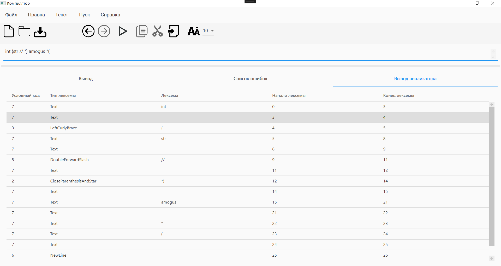

<!DOCTYPE html>
<html>
<body>
  <h1>Компилятор</h1>
  
Разработка текстового редактора с функциями языкового процессора.

  <h2>Оглавление</h2>
  <ul>
    <li><a href="#lab1">Лабораторная работа №1: Разработка пользовательского интерфейса (GUI) для языкового процессора</a></li>
    <li><a href="#lab2">Лабораторная работа №2: Разработка лексического анализатора (сканера)</a></li>
    <li><a href="#lab3">Лабораторная работа №3: Разработка синтаксического анализатора (парсера)</a></li>
    <li><a href="#lab4">Лабораторная работа №4: Нейтрализация ошибок (метод Айронса)</a></li>
    <li><a href="#lab5">Лабораторная работа №5: Включение семантики в анализатор. Создание внутренней формы представления программы</a></li>
    <li><a href="#lab6">Лабораторная работа №6: Реализация алгоритма поиска подстрок с помощью регулярных выражений</a></li>
    <li><a href="#lab7">Лабораторная работа №7: Реализация метода рекурсивного спуска для синтаксического анализа</a></li>
  </ul>

  <h2 id="lab1">Лабораторная работа №1: Разработка пользовательского интерфейса (GUI) для языкового процессора</h2>
  
Тема: разработка текстового редактора с возможностью дальнейшего расширения функционала до языкового процессора.

  
Цель работы: разработать приложение с графическим интерфейсом пользователя, способное редактировать текстовые данные. Это приложение будет базой для будущего расширения функционала в виде языкового процессора.

  
Язык реализации: C#, WPF.

  <h3>Интерфейс текстового редактора</h3>
  
Главное окно программы

  
  
  <h3>Получившийся текстовый редактор имеет следующие элементы:</h3>
  <ol>
    <li value="1">Заголовок окна.</li>  
    
Содержит информацию о названии открытого файла, полного пути к нему, а также о том, сохранен ли он на текущий момент (наличие символа звездочки справа от названия означает наличие несохраненных изменений).

    <li value="2">Меню.</li>  
    <table>
      <tr>
        <th>Пункт меню</th>
        <th>Подпункты</th>
      </tr>
      <tr>
        <td>Файл</td>
        <td></td>
      </tr>
      <tr>
        <td>Правка</td>
        <td></td>
      </tr>
      <tr>
        <td>Текст</td>
        <td></td>
      </tr>
      <tr>
        <td>Пуск</td>
        <td>Отсутствует</td>
      </tr>
      <tr>
        <td>Справка</td>
        <td></td>
      </tr>
    </table>
    <li value="3">Панель инструментов</li>
	
      <ul>
        <li>Создать</li>
        <li>Открыть</li>
        <li>Сохранить</li>
        <li>Отменить</li>
        <li>Повторить</li>
        <li>Копировать</li>
        <li>Вырезать</li>
        <li>Вставить</li>
        <li>Изменить размер текста</li>
      </ul>
    <li value="4">Область редактирования</li>
    
Поддерживаются следующие функции:

      <ul>
        <li>Изменение размера текста</li>
        <li>Открытие файла при перетаскивании его в окно программы</li>
      </ul>
    <li value="5">Область отображения результатов</li>
    
В область отображения результатов выводятся сообщения и результаты работы языкового процессора.

    
Поддерживаются следующие функции:

      <ul>
        <li>Изменение размера текста</li>
        <li>Отображение ошибок в виде таблицы</li>
      </ul>
  </ol>
    <h3>Справочная система</h3>
    
Разделы справочной системы открываются как HTML-документы в браузере.

    <table>
      <tr>
        <th>Раздел</th>
        <th>Изображение</th>
      </tr>
      <tr>
        <td>Вызов справки</td>
        <td></td>
      </tr>
      <tr>
        <td>О программе</td>
        <td></td>
      </tr>
    </table>
    <h3>Вывод сообщений</h3>
    <table>
      <tr>
        <th>Сообщение</th>
        <th>Описание</th>
      </tr>
      <tr>
        <td>Закрытие окна программы</td>
        <td>Появляется при закрытии программы нажатием крестика или комбинацией клавиш при наличии несохраненных изменений</td>
      </tr>
      <tr>
        <td>Сохранение изменений</td>
        <td>Появляется при попытке открыть существующий файл или создать новый при наличии несохраненных изменений	Сохранение изменений</td>
      </tr>
    </table>
   
  <h2 id="lab2">Лабораторная работа №2: Разработка лексического анализатора (сканера)</h2>
  
Тема: разработка лексического анализатора (сканера).

  
Цель работы: изучить назначение лексического анализатора. Спроектировать алгоритм и выполнить программную реализацию сканера.

  
  <table>
    <tr>
      <th>№</th>
      <th>Тема</th>
      <th>Пример верной строки</th>
      <th>Справка</th>
    </tr>
    <tr>
      <td>50</td>
      <td>Комментарии языка Pascal</td>
      <td>{ Это комментарий } (* Это тоже комментарий *) </td>
      <td><a href="https://pascalabc.net/downloads/pabcnethelp/index.htm?page=LangGuide/_ProgrStruct_Defs/comments.html		">Справка</a></td>
    </tr>
  </table>

  <h3>В соответствии с вариантом задания необходимо:</h3>
  <ol>
    <li>Спроектировать диаграмму состояний сканера.</li>
    <li>Разработать лексический анализатор, позволяющий выделить в тексте лексемы, иные символы считать недопустимыми (выводить ошибку).</li>
    <li>Встроить сканер в ранее разработанный интерфейс текстового редактора. Учесть, что текст для разбора может состоять из множества строк.</li>
  </ol>

  
Входные данные: строка (текст программного кода).

  
Выходные данные: последовательность условных кодов, описывающих структуру разбираемого текста с указанием места положения и типа.

  <h3>Примеры допустимых строк</h3>
  <pre>
	{ Это комментарий } (* Это тоже комментарий *)

	var Version: integer; // Версия продукта
	
	{ Это еще один (* комментарий *)}
  </pre>

  <h3>Диаграмма состояний сканера</h3>
  

  <h3>Тестовый пример</h3>
  <h4>Тест. Пример, показывающий все возможные лексемы, которые могут быть найдены лексическим анализатором.</h4>
  
  <h2 id="lab2">Лабораторная работа №3: Разработка синтаксического анализатора (парсера).</h2>
  
Тема: разработка лексического анализатора (сканера).

  
Цель работы: Изучить назначение синтаксического анализатора. Спроектировать алгоритм и выполнить программную реализацию парсера.

  <table>
    <tr>
      <th>№</th>
      <th>Тема</th>
      <th>Пример верной строки</th>
      <th>Справка</th>
    </tr>
    <tr>
      <td>50</td>
      <td>Комментарии языка Pascal</td>
      <td>{ Это комментарий } (* Это тоже комментарий *) </td>
      <td><a href="https://pascalabc.net/downloads/pabcnethelp/index.htm?page=LangGuide/_ProgrStruct_Defs/comments.html		">Справка</a></td>
    </tr>
  </table>

  <h3>В соответствии с вариантом задания на курсовую работу необходимо:</h3>
  <ol>
    <li>Разработать автоматную грамматику.</li>
    <li>Спроектировать граф конечного автомата (перейти от автоматной грамматики к конечному автомату).</li>
    <li>Выполнить программную реализацию алгоритма работы конечного автомата.</li>   
    <li>Встроить разработанную программу в интерфейс текстового редактора, созданного на первой лабораторной работе.</li>
  </ol>
  <h3>Грамматика:</h3>
  
G[I]; 
Vt = { 'a'...'z', 'A'...'Z', '0'...'9', '(*', '*)', '{', '}', '//' }
Vn = { A, B, C, D, E, F, G, H, I }
P = {
	I -> { A | // B | ( C
	A -> ( symbol | ( | ) | // | # | { | * ) A | } D
	D -> ( symbol | ( | ) | // | # | { | * ) A | } D | epsilon
	B -> ( symbol | ( | ) | // | { | } | * ) B | # E
	E -> ( symbol | ( | ) | // | { | } | * ) B | # E | epsilon
	C -> * F
	F -> ( symbol | ( | ) | // | # | { | } ) F | * G 
	G -> ( symbol | ( | ) | // | # | { | } ) F | * G | ) H
	H -> ( symbol | ( | ) | // | # | { | } ) F | * G | epsilon
	symbol -> ‘a’ | ‘b’ | … | ‘z’ | ‘A’ | ‘B’ | … | ‘Z’ | ‘0’ | ‘1’ | … | ‘9’
}

</body>
</html>
